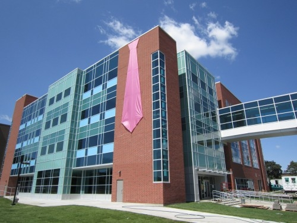

# Convolutional Neural Networks for Visual Recognition

## This course is offered by the [Stanford University](http://cs231n.stanford.edu/) at Spring 2017.

Recent developments in neural network (aka “**deep learning**”) approaches have greatly advanced the performance of these state-of-the-art visual recognition systems. This course is a deep dive into details of the deep learning architectures with a focus on learning end-to-end models for these tasks, particularly image classification. 

## What did I learn in this course?
> * **Convolutional Neural Nets** (Deep Learning) in classifying images with high accuracy.
> * **Hyperparameters tuning** for better optimization and convergence rate during training phase.
> * **Activation functions** (ie. RELU, tanh) to introduce non-linearity in neural networks.[1]
> * Pros and cons of different **optimization algorithms in Neural Networks** (ie. *SGD with momentum*, *RMSProp*, *AdaGrad*, *Adam* etc.), and implemented them from scratch.[1]
> *  **Backpropagation** in Neural Networks using **computational graph**.[1]
> * **BatchNormalization** and **Dropout** which improves optimization.[1]
> * Combined **Convolutional Neural Nets** and **LSTM Recurrent Nets** to implement an image captioning system.
> * **Style Transfer**, **Generative Adversarial Network(GAN)** in generating realistic fake images.
> * **Visualizing Image Classification** to understand what Convolutional Neural Nets understands about images.
> * **Tensorflow** framework.
> * **Transfer Learning**.

*[1] Implemented from scratch without Tensorflow.*

## Cool projects completed in this course:
### :ghost: [Style Transfer](https://github.com/harry688tan96/VisualRecognition_DeepLearning/blob/master/assignment3/StyleTransfer-TensorFlow.ipynb)
* Implemented Style Transfer technique on images using pretrained [SqueezeNet](https://arxiv.org/abs/1602.07360).

Styles from various paintings are added to a photo of the M3 Math Building in University of Waterloo. Click on thumbnails to see full applied style images.

  

 

 

### :ghost: [Class Visualization](https://github.com/harry688tan96/VisualRecognition_DeepLearning/blob/master/assignment3/NetworkVisualization-TensorFlow.ipynb)
* Produced images that the Deep Neural Network (DNN) will recognize as the target class. These images which were shown to individual neurons in the DNN maximally activated these neurons. Thus, the neurons learned how to "differentiate" images that were fed to them.
##### Results:
How the neurons in DNN see **Tarantula**:

How the neurons in DNN see **Gorilla**:

### :ghost: [Generative Adversarial Networks (GANs)](https://github.com/harry688tan96/VisualRecognition_DeepLearning/blob/master/assignment3/GANs-TensorFlow.ipynb)
* Generated realistic fake MNIST images using the following Generative Adversarial Networks technique:
  * Vanilla GANs
  * Least Square GANs
  * Deep Convolutional GANs
##### Results:
<table align="center">
  <caption></caption>
  <tr>
    <th>Vanilla GANs</th>
    <th>Least Squares GANs</th>
    <th>DC GANs</th>
  </tr>
  <tr>
    <td></td>
    <td></td>
    <td></td>
  </tr>
</table>
